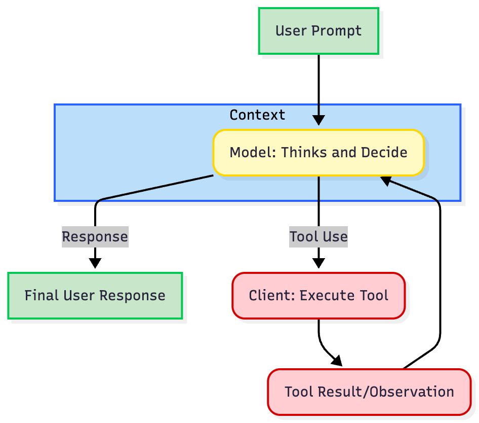
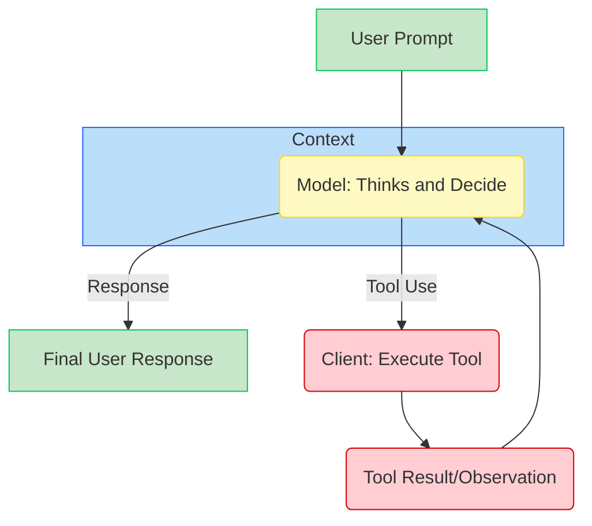

# Practical Guide on how to build an Agent with Gemini

It seems complicated, when you watch an AI agent edit multiple files, run commands, handle errors, and iteratively solve a problem, it feels like magic. But it isn’t. The secret to building an agent is that there is no secret.

The core of an Agent is surprisingly simple: It is a Large Language Model (LLM) running in a loop, equipped with tools it can choose to use.

If you can write a loop in Python, you can build an agent. This guide will walk you through the process, from a simple API call to a functioning CLI Agent.

## What actually is an Agent?

Traditional software workflows are prescriptive and follow predefined paths (`Step A -> Step B -> Step C`), **Agents** are System that uses an LLM to dynamically decide the control flow of an application to achieve a user goal.

An agent generally consists of these core components:

1. **The Model (Brain):** The reasoning engine, in our case a Gemini model. It reasons through ambiguity, plans steps, and decides when it needs outside help.
2. **Tools (Hands):** Functions the agent can execute to interact with the outside world/environment (e.g., searching the web, reading a file, calling an API).
3. **Context/Memory (Workspace):** The information the agent has access to at any moment. Managing this effectively, known as **Context Engineering**.
4. **The Loop (Life):** A `while` loop that allows the model to: Observe → Think → Act → Observe again, until the task is complete.





**"The Loop"** of nearly every agent is an iterative process:

1. **Define Tool Definitions:** You describe your available tools (e.g., `get_weather`) to the model using a structured JSON format.
2. **Call the LLM:** You send the user's prompt *and* the tool definitions to the model.
3. **Model Decision:** The model analyzes the request. If a tool is needed, it returns a structured `tool use` containing the tool name and arguments.
4. **Execute Tool (Client Responsibility):** The client/application code intercepts this `tool use`, executes the actual code or API call, and captures the result.
5. **Respond and Iterate:** You send the result (the `tool response`) back to model. The model uses this new information to decide the next step—either calling another tool or generating the final response.

## Building an Agent

We will now build a simple agent step-by-step, progressing from basic text generation to a functional CLI agent using the Gemini Python SDK. 

_Prerequisites: Install the SDK (`pip install google-genai`) and set your `GEMINI_API_KEY` environment variable ([Get it in AI Studio](https://aistudio.google.com/app/apikey))._

### Step 1: Basic Text Generation and Abstraction

The first step is to create a baseline interaction with the LLM, for us Gemini. We are going to create a simple Agent class abstraction to structure our code, which we will extend throughout this guide. We will first start with a simple chatbot that maintains a conversation history.

```python
from google import genai
from google.genai import types

class Agent:
    def __init__(self, model: str):
        self.model = model
        self.client = genai.Client()
        self.contents = []

    def run(self, contents: str):
        self.contents.append({"role": "user", "parts": [{"text": contents}]})

        response = self.client.models.generate_content(model=self.model, contents=self.contents)
        self.contents.append(response.candidates[0].content)

        return response

agent = Agent(model="gemini-flash-latest")
response1 = agent.run(
    contents="Hello, What are top 3 cities in Germany to visit? Only return the names of the cities."
)

print(f"Model: {response1.text}")
# Output: Berlin, Munich, Cologne 
response2 = agent.run(
    contents="Tell me something about the second city."
)

print(f"Model: {response2.text}")
# Output: Munich is the capital of Bavaria and is known for its Oktoberfest.
```

This is *not* an agent yet. It is a standard chatbot. It maintains state but cannot take action, has no "hands."

---

### Step 2: Giving it Hands (Tool Use)

To start turning this an agent, we need **Tool Use** or Function Calling. We provide the agent with tools. This requires defining the implementation (the Python code) and the definition (the schema the LLM sees). If the LLM believes that tool will help solve a user's prompt, it will return a structured request to call that function instead of just text. 

We are going to create 3 tools, `read_file`, `write_file`, and `list_dir`. A tool Definition is a JSON schema that defines the `name`, `description`, and `parameters` of the tool.

_**Best Practice**: Use the `description` fields to explain when and how to use the tool. The model relies heavily on these to understand when and how to use the tool. Be explicit and clear._

```python
import os
import json

read_file_definition = {
    "name": "read_file",
    "description": "Reads a file and returns its contents.",
    "parameters": {
        "type": "object",
        "properties": {
            "file_path": {
                "type": "string",
                "description": "Path to the file to read.",
            }
        },
        "required": ["file_path"],
    },
}

list_dir_definition = {
    "name": "list_dir",
    "description": "Lists the contents of a directory.",
    "parameters": {
        "type": "object",
        "properties": {
            "directory_path": {
                "type": "string",
                "description": "Path to the directory to list.",
            }
        },
        "required": ["directory_path"],
    },
}

write_file_definition = {
    "name": "write_file",
    "description": "Writes a file with the given contents.",
    "parameters": {
        "type": "object",
        "properties": {
            "file_path": {
                "type": "string",
                "description": "Path to the file to write.",
            },
            "contents": {
                "type": "string",
                "description": "Contents to write to the file.",
            },
        },
        "required": ["file_path", "contents"],
    },
}

def read_file(file_path: str) -> dict:
    with open(file_path, "r") as f:
        return f.read()

def write_file(file_path: str, contents: str) -> bool:
    """Writes a file with the given contents."""
    with open(file_path, "w") as f:
        f.write(contents)
    return True

def list_dir(directory_path: str) -> list[str]:
    """Lists the contents of a directory."""
    full_path = os.path.expanduser(directory_path)
    return os.listdir(full_path)

file_tools = {
    "read_file": {"definition": read_file_definition, "function": read_file},
    "write_file": {"definition": write_file_definition, "function": write_file},
    "list_dir": {"definition": list_dir_definition, "function": list_dir},
}
```

Now we integrate the `tools` and function calls into our Agent class along side a System Instruction. System

```python
from google import genai
from google.genai import types

class Agent:
    def __init__(self, model: str,tools: list[dict]):
        self.model = model
        self.client = genai.Client()
        self.contents = []
        self.tools = tools

    def run(self, contents: str):
        self.contents.append({"role": "user", "parts": [{"text": contents}]})

        config = types.GenerateContentConfig(
            tools=[types.Tool(function_declarations=[tool["definition"] for tool in self.tools.values()])],
        )

        response = self.client.models.generate_content(model=self.model, contents=self.contents, config=config)
        self.contents.append(response.candidates[0].content)

        return response

agent = Agent(model="gemini-flash-latest", tools=file_tools)

response = agent.run(
    contents="Can you list my files in the current directory?"
)
print(response.function_calls)
# Output: [FunctionCall(name='list_dir', arguments={'directory_path': '.'})]
```

Great! The model has successfully called the tool. Now, we need to add the tool execution logic to our Agent class and the loop return the result back to the model.

## Step 3: Closing the Loop (The Agent)

An Agent isn't about generating one tool call, but about generating a series of tool calls, returning the results back to the model, and then generating another tool call, and so on until the task is completed.

The `Agent` class handles the core loop: intercepting the `FunctionCall`, executing the tool on the client side, and sending back the `FunctionResponse`. We also add a `SystemInstruction` to the model to guide the model on what to do.

```python
# ... Code for the tools and tool definitions from Step 2 should be here ...

from google import genai
from google.genai import types

class Agent:
    def __init__(self, model: str,tools: list[dict], system_instruction: str = "You are a helpful assistant."):
        self.model = model
        self.client = genai.Client()
        self.contents = []
        self.tools = tools
        self.system_instruction = system_instruction

    def run(self, contents: str | list[dict[str, str]]):
        if isinstance(contents, list):
            self.contents.append({"role": "user", "parts": contents})
        else:
            self.contents.append({"role": "user", "parts": [{"text": contents}]})

        config = types.GenerateContentConfig(
            system_instruction=self.system_instruction,
            tools=[types.Tool(function_declarations=[tool["definition"] for tool in self.tools.values()])],
        )

        response = self.client.models.generate_content(model=self.model, contents=self.contents, config=config)
        self.contents.append(response.candidates[0].content)

        if response.function_calls:
            functions_response_parts = []
            for tool_call in response.function_calls:
                print(f"[Function Call] {tool_call}")

                if tool_call.name in self.tools:
                    result = {"result": self.tools[tool_call.name]["function"](**tool_call.args)}
                else:
                    result = {"error": "Tool not found"}

                print(f"[Function Response] {result}")
                functions_response_parts.append({"functionResponse": {"name": tool_call.name, "response": result}})

            return self.run(functions_response_parts)
        
        return response

agent = Agent(
    model="gemini-flash-latest", 
    tools=file_tools, 
    system_instruction="You are a helpful Coding Assistant. Respond like you are Linus Torvalds."
)

response = agent.run(
    contents="Can you list my files in the current directory?"
)
print(response.text)
# Output: [Function Call] id=None args={'directory_path': '.'} name='list_dir'
# [Function Response] {'result': ['.venv', ... ]}
# There. Your current directory contains: `LICENSE`,
```

Congratulations. You just built your first functioning agent.

## Phase 4: Multi-turn CLI Agent

Now we can run our agent in a simple CLI loop. It takes surprisingly little code to create highly capable behavior.

```python
# ... Code for the Agent, tools and tool definitions from Step 3 should be here ...

agent = Agent(
    model="gemini-flash-latest", 
    tools=file_tools, 
    system_instruction="You are a helpful Coding Assistant. Respond like you are Linus Torvalds."
)

print("Agent ready. Ask it to check files in this directory.")
while True:
    user_input = input("You: ")
    if user_input.lower() in ['exit', 'quit']:
        break

    response = agent.run(user_input)
    print(f"Linus: {response.text}\n")
```

## Best Practices for Engineering Agents

Building the loop is easy; making it reliable, transparent, and controllable is hard. Here are key engineering principles derived from top industry practices, grouped by functional area.

### 1. Tool Definition & Ergonomics
Your tools are the interface for the model. Don't just wrap your existing internal APIs. If a tool is confusing to a human, it's confusing to the model:

*   **Clear Naming:** Use obvious names like `search_customer_database` rather than `cust_db_v2_query`.
*   **Precise Descriptions:** Gemini reads the function docstrings to understand *when* and *how* to use a tool. Spend time writing these carefully—it is essentially "prompt engineering" for tools.
*   **Return Meaningful Errors:** Don't return a 50-line Java stack trace. If a tool fails, return a clear string like `Error: File not found. Did you mean 'data.csv'?`. This allows the agent to self-correct.
*   **Tolerate Fuzzy Inputs:** If a model frequently guesses file paths wrong, update your tool to handle relative paths or fuzzy inputs rather than just erroring out.

### 2. Context Engineering
Models have a finite "attention budget." Managing what information enters the context is crucial for performance and cost.

*   **Don't "Dump" Data:** Don't have a tool that returns an entire 10MB database table. Instead of `get_all_users()`, create `search_users(query: str)`.
*   **Just-in-time Loading:** Instead of pre-loading all data (traditional RAG), use just-in-time strategies. The agent should maintain lightweight identifiers (file paths, IDs) and use tools to dynamically load content only when needed.
*   **Compression:** For very long-running agents, summarize the history, remove old context or start a new sessions.
*   **Agentic Memory:** Allow the agent to maintain notes or a scratchpad persisted *outside* the context window, pulling them back in only when relevant.

### 3. Don't over engineer

It's tempting to build complex multi-agent systems. Don't.

*   **Maximize a Single Agent First:** Don't immediately build complex multi-agent systems. Gemini is highly capable of handling dozens of tools in a single prompt.
*   **Escape Hatches:** Ensure loops can be stopped like a `max_iterations` break (e.g., 15 turns).
*   **Guardrails and System Instructions:** Use the `system_instruction` to guide the model with hard rules (e.g., "You are strictly forbidden from offering refunds greater than $50") or use external classifier.
*   **Human-in-the-loop:** For sensitive actions (like `send_email` or `execute_code`), pause the loop and require user confirmation before the tool is actually executed.
*   **Prioritize Transparency and Debugging:** Log tool calls and parameters. Analyzing the model's reasoning helps identify if issues, and improve the agent over time. 

## Conclusion

Building an agent is no longer magic; it is a practical engineering task. As we've shown, you can build a working prototype in under 100 lines of code. While understanding these fundamentals is key, don't get bogged down re-engineering the same pattern over and over. The AI community has created fantastic open-source libraries that can help you build more complex and robust agents faster. 